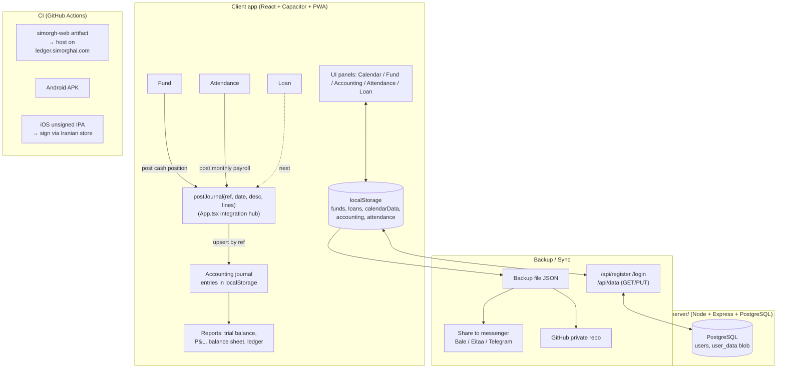

# simorgh-ledger (Simorgh) — Roadmap & Architecture

> This document explains **what we are building, why, and what's next**, so you can navigate
> the repo yourself. New code comments are written in **English**. This is the high-level map.

## Vision
A single **integrated, cloud-enabled, mobile-first, low-cost** platform for small/medium
businesses and families:
Tri-calendar (Jalali/Gregorian/Hijri) + prayer times + ledger + loan calculator +
Gharz-al-Hasaneh fund + **double-entry accounting** + **attendance** (+ inventory & payroll next).
Differentiator: **all of this in one app**, on **Android / iOS (web) / Windows (web)**, with
**Iranian cloud sync**.

---

## Competitor Analysis & Winning Strategy
> Goal: not to clone large ERPs, but to **win on their weak points** + simplicity + price + integration.

### Rahkaran (Hamkaran System)
- Strengths: full enterprise ERP (accounting, inventory, payroll, manufacturing, CRM); very established.
- Weaknesses: expensive, heavy, complex/slow rollout, built for large orgs not SMBs, weaker mobile/cloud.
- **Our edge:** 5-minute setup, mobile-first, Iranian cloud, low price, simple UX.

### Nosa
- Strengths: strong/accurate financial accounting, standard reports, popular with accountants.
- Weaknesses: mostly desktop/Windows, weak cloud & mobile, dated UI, limited operational integration.
- **Our edge:** same double-entry rigor + reports, but **web/mobile + sync + integrated** with fund/loan/attendance.

### Mahak
- Strengths: simple & cheap for small shops; invoicing, inventory, buy/sell.
- Weaknesses: limited cloud/mobile, hardware/license lock, limited custom reports.
- **Our edge:** true web app, cloud multi-device, printable/PDF reports, no hardware lock.

### Kasra (attendance/payroll)
- Strengths: time clocks/devices, work-time & payroll calculation, legal reports.
- Weaknesses: device-dependent & on-prem, expensive, limited mobile/cloud, rigid for small business.
- **Our edge:** **device-free** attendance (log via mobile/web), cloud, simple, work-time/overtime
  calculation **wired into payroll & accounting**.

### Strategy summary
1. **Integration**: one event (fund deposit, loan installment, salary) auto-creates an **accounting journal entry**.
2. **Cloud/mobile/web**: be strong exactly where competitors are weak.
3. **Simplicity + price**: easy setup, free/cheap.
4. **Localization**: Jalali calendar, prayer times, Iranian hosting, Iranian messengers.

---

## Architecture (file map)
- `src/App.tsx` — core app: calendar, state, menus, backup, account/sync, panel wiring, **`postJournal`** integration hub.
- `src/Fund.tsx` — Gharz-al-Hasaneh fund (shares, draw, rounding, extra recipients, reports, accounting hook).
- `src/Accounting.tsx` — double-entry accounting (journal, trial balance, ledger, P&L, balance sheet, print).
- `src/Attendance.tsx` — attendance (employees, daily log, work-time/overtime, payroll estimate, report, accounting hook).
- `src/Tools.tsx` — tools, loan calculator, range reports.
- `src/calendar.ts` — Jalali/Gregorian/Hijri calendar helpers.
- `server/` — Node.js + Express + PostgreSQL backend (auth + data sync). See `server/README.md`.
- **Client storage**: `localStorage` keys (`funds`, `loans`, `calendarData`, `accounting`, `attendance`, ...)
  collected in `BACKUP_KEYS` for backup/sync.

## Data & integration flow

### `postJournal` (the integration hub)
- Lives in `App.tsx`. Modules call it via an optional `onPostJournal` prop.
- **Upsert by `ref`**: re-posting the same source updates its entry (no duplicates).
- Resolves each line to an account by (type [+ name]); auto-creates missing accounts.
- Current producers: **payroll** (`payroll-<ym>`), **fund** (`fund-<id>`). Next: **loan**.

## Status (✓ done / ◻ next)
- ✓ Tri-calendar + prayer times + ledger + loan
- ✓ Gharz-al-Hasaneh fund (rounding, extra recipients, reports)
- ✓ Backup (file / messenger / GitHub)
- ✓ Web (PWA) + Android (APK) + iOS (IPA)
- ✓ User account + cloud sync (Node + PostgreSQL)
- ✓ Double-entry accounting (journal / trial balance / ledger / P&L / balance sheet / print) + hierarchical
      chart of accounts (گروه/کل/معین), VAT, and guided quick-entry (see Accounting upgrade below)
- ✓ Attendance (employees, daily log, work-time/overtime, payroll, monthly report)
- ✓ Integration: attendance payroll → accounting; fund cash position → accounting; loan → accounting (`postJournal`)
- ✓ Inventory module (items, in/out, stock, value, report) with auto-accounting (purchase/sale → journal)
- ✓ Payslip (base + overtime + allowances − deductions = net), printable
- ✓ Access control: groups + permissions + users, device-side gating, admin PIN, worker self-service mode
- ✓ Protective access (terminal login): each user can carry a card/badge code and/or a WebAuthn biometric
      credential; at any terminal the operator identifies by card or face/fingerprint and becomes the active
      user, gaining their group's predefined permissions (`can()`).
- ✓ Admin can edit group permissions (raise/lower access per group)
- ✓ Leave management (kardex like Kasra): annual entitlement (استحقاقی), carry-in, used/remaining (مانده),
      required-to-use (ملزم به استفاده), annual carryover/savings (ذخیره‌ی سالیانه); CSV export of the kardex
- ✓ Leave permits with **multi-level approval** (سطوحِ تایید: سرپرست → مدیر → …) + status (تایید/رد/در انتظار);
      workers submit their own requests in self-service mode; per-company leave-registration policy
- ✓ Manager hierarchy + **کارتابل** (manager inbox): each employee has a سرپرست; requests route up the chain
      (سرپرست → مدیر → …) and each manager sees only requests awaiting them; admin (مدیرِ ارشد) sees all + history
- ✓ Request types beyond leave: روزانه / ساعتی / استعلاجی / بدون حقوق / مأموریت / **ثبتِ تردد** (punch correction),
      each with its own rules (enabled, reason-required, max-days)
- ✓ **User-definable leave/permit types** (the combobox the user can extend): per type unit (day/hour),
      pay treatment (paid/unpaid) and whether it draws the annual استحقاقی balance — directly drives payroll
- ✓ **Kasra-style worker request form**: two-step combobox نوعِ مجوز (category) → مجوز (type), grouped by
      category; extra fields از ساعت/تا ساعت (hourly), جانشین (substitute), and mission مبدا/مقصد/موضوع
- ✓ **Daily punch kardex** (کارکرد روزانه): clock-in/out per day → worked, late (تأخیر), early-leave (تعجیل),
      shortfall (کسرِ کار) and surplus (مازادِ حضور) computed against the company work rules; CSV export
- ✓ **Advanced work policy** (admin-configurable, > Kasra): morning lateness grace, allowed late count per
      month (forgiven), overtime minimum threshold, and unpaid breakfast/lunch break deduction — all fed into payroll
- ✓ **Integrated payroll**: base = worked days/hours + PAID leave; overtime = manual + punch surplus (×1.4);
      shortfall + unpaid hourly leave reduce salary; fuller payslip lines
- ✓ **Configurable حکم salary components** (اجزای حکم): company-defined catalogue (حق مسکن، بن، اولاد،
      سنوات، فوق‌العاده شغل، تأهل، بیمه…), per-employee amounts, itemized in the decree + payslip, summed
      into net pay and the payroll journal entry
- ◑ **Accounting upgrade** (original implementation from standard accounting principles — NOT copied from any
      vendor's materials; we respect their copyright):
      - ✓ Hierarchical chart of accounts (کدینگ: گروه/کل/معین) with a full standard default chart + tree view;
            only leaf accounts are postable; trial balance lists postable accounts
      - ✓ VAT (مالیات بر ارزش افزوده) with a configurable rate, applied on sales/purchases
      - ✓ Guided quick-entry for non-accountants (ثبتِ سریع): sale / purchase / receive / pay / cash-bank
            transfer / capital — auto-builds the correct balanced double-entry with a live preview
      - ✓ Multi-level grouped trial balance (گروه/کل/معین) with rolled-up subtotals
      - ✓ Fiscal-year close (سندِ اختتامیه): zero income/expense into retained earnings; reversible
      - ✓ VAT return (اظهارنامه): output VAT − input VAT = net payable/credit
      - ✓ Subsidiary ledger (تفصیلی): counterparties (مشتری/تأمین‌کننده) with per-party balance + کارت حساب,
            tagged on credit sales/purchases via the guided quick-entry
      - ✓ Cost centers (مرکز هزینه): tag expenses, per-center expense report
      - ✓ Opening entry (سندِ افتتاحیه): per-account starting balances, auto-plugged to سرمایه to balance
      - ✓ Company name on printed financial statements (سربرگ)
      - ✓ Official sales invoice (فاکتورِ فروش): multi-item, discount + VAT, cash/bank/credit; auto-posts the
            sale journal (party-tagged for credit) and is printable + reprintable from the issued list
      - ✓ Purchase invoice (فاکتورِ خرید): same UI/mode toggle; posts inventory-or-expense + input VAT, supplier
            payable tagged on credit purchases
      - ◻ next: link invoices to inventory stock levels, statutory statement layout, multi-book/period
- ◻ Windows desktop installer (.exe) via Electron + Windows CI  (deferred — not yet)
- ✓ Inventory product groups (گروه کالا): definable hierarchical category tree (e.g. الکتریکال ›
      اندازه‌گیری/حفاظت/مصرفی/اداری), assigned on item entry; group filter + column in the stock report & CSV.
- ✓ Multi-warehouse (چند انبار) + sections (بخش): define warehouses and their sections; each movement is
      tagged with a warehouse (and optional section); stock is tracked per warehouse; report warehouse filter
      and per-warehouse stock shown in the barcode scan inquiry.
      ✓ Accounting integration: each warehouse posts to its own inventory account «موجودیِ کالا (نام)»;
      warehouse transfer posts one balanced entry (Debit dest inventory / Credit source inventory at cost).
      ✓ Per-warehouse stock matrix report (items × warehouses) + minimum-stock / reorder-point alerts (نقطه سفارش).
      ✓ Barcode scan into the sales invoice: adds the item line, reduces inventory stock, and posts COGS
        (Debit بهای تمام‌شده / Credit موجودیِ کالا) — invoice ↔ inventory ↔ accounting fully wired.
- ◑ Inventory barcodes: ✓ auto-generate + print Code39 label (pure JS, offline) per item; ✓ warehouse
      location, partner code (کد همکار), company standard code; ✓ scan to look up stock/price (استعلام) and
      pick items for in/out — via hardware keyboard-wedge scanner OR the **phone camera** (ZXing, works in the
      Android app WebView; CAMERA permission requested natively in MainActivity).
      ✓ Scan into the sales invoice (typed/hardware + phone camera via shared `src/Scanner.tsx`).
      ✓ Phone-as-wireless-scanner relay: in-memory server relay (`server/scanRelay.js`, no DB) — desktop
        shows a 6-digit channel («📡 اسکنرِ همراه» on the invoice) and polls `/api/scan/:ch`; the phone joins
        the channel («📡 اسکنرِ بی‌سیم» in inventory), scans continuously (ZXing continuous mode with 2s
        dedupe) and pushes each code; scans appear as invoice lines on the desktop. Channels expire after
        10 idle minutes; pairing = knowing the displayed code.
- ◑ Attendance device matching: face / fingerprint / RFID-card readers
      - ✓ phase 0 (zero-cost, for small companies): **kiosk mode (ساعت‌زنی)** — the guard's phone IS the
        punch device. Print a Code39 badge card per employee (🪪 in the staff tab); scanning the badge
        (camera, continuous, or a keyboard-wedge RFID/barcode card reader) records in/out with the exact
        time, auto-marks the day present, and feeds the punch kardex (تأخیر/تعجیل/کسرِ کار) → payroll.
      - ✓ phase 1: **biometric self check-in (WebAuthn)** — the worker registers once on their own phone
        (platform authenticator, userVerification required); every punch then requires the phone's OS
        fingerprint/face prompt and records in/out into the same punch kardex. Falls back gracefully with
        a message where WebAuthn is unavailable (use the web app in Chrome, or the kiosk badge card).
      - ✓ admin chooses which capture methods are active (card/badge · phone biometric · network device)
        in the «قوانین» tab; disabled methods are hidden in the kiosk / self screens.
      - ✓ phase 2: **network device relay** — external face/fingerprint/card devices (or a tiny bridge
        script beside them) POST punch logs `{code, time?, dir?}` to `/api/att/:channel` on the server
        (`server/attRelay.js`, in-memory, 30-min idle TTL); the kiosk tab opens a listen channel, shows
        the device URL, polls every 3s and applies logs to the punch kardex in one batched commit,
        honoring the device's own time and direction, with a live feed + unknown-code flagging.
- ◻ CSV/Excel export of all reports
- ◑ Server multi-tenant foundation: orgs + members(role) + shared org data with **server-enforced** role gating (workers are read-only). Endpoints: `/api/org*`. (Done & tested; client wiring next.)
- ◻ Company-edition lead form → `/api/quote` (done); next: pricing + payment gateway (Zarinpal) → org activation
- ◻ Relational journal storage on server (replace blob) for per-record role filtering & heavy reports
- ◻ Client wiring: read/write via `/api/org/data`, role from `/api/org` (keep offline cache)
- ◻ Personnel order / employment decree (حکم کارگزینی): printable per employee
- ◻ Multi-company/multi-book, statutory reports

## Product principles (owner directives)
- **SaaS first**: the cloud multi-tenant service is the core product; the standalone apps (Android/iOS/Windows) are companions to it.
- **Modern 2026 look**: great fonts, polished dialogs/messages, refined graphics — a complete, premium feel.
- **Separated, uncluttered environments**: keep each area (accounting / attendance / inventory / fund) in its own clean space; avoid a crowded single screen so users don't get confused. Prefer focused modules and a clean entry/dashboard over piling everything into one menu.

## Coding conventions
- Each module is a self-contained component with `state / onChange / onClose / confirm` props.
- Persist to `localStorage`; **add every new module key to `BACKUP_KEYS`** so it syncs.
- New comments are in **English** and explain the "why", not just the "what".
