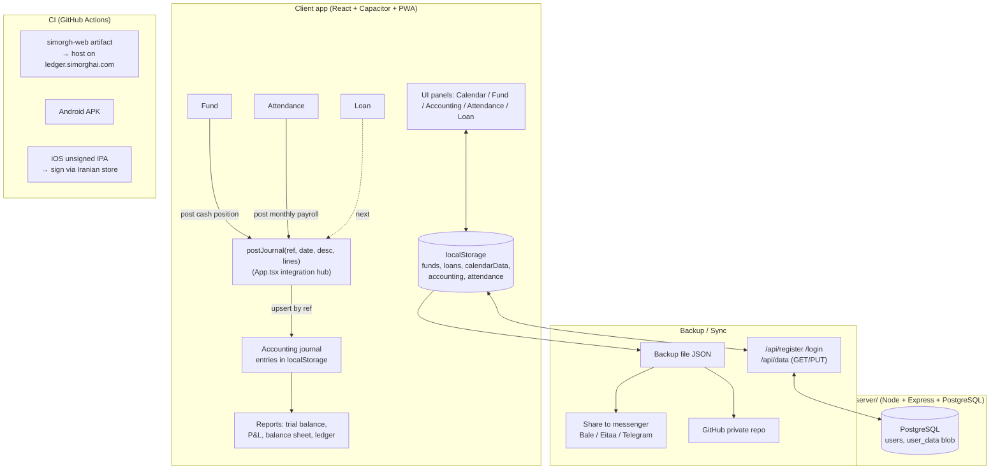

# simorgh-ledger (Simorgh) — Roadmap & Architecture

> This document explains **what we are building, why, and what's next**, so you can navigate
> the repo yourself. New code comments are written in **English**. This is the high-level map.

## Vision
A single **integrated, cloud-enabled, mobile-first, low-cost** platform for small/medium
businesses and families:
Tri-calendar (Jalali/Gregorian/Hijri) + prayer times + ledger + loan calculator +
Gharz-al-Hasaneh fund + **double-entry accounting** + **attendance** (+ inventory & payroll next).
Differentiator: **all of this in one app**, on **Android / iOS (web) / Windows (web)**, with
**Iranian cloud sync**.

---

## Competitor Analysis & Winning Strategy
> Goal: not to clone large ERPs, but to **win on their weak points** + simplicity + price + integration.

### Rahkaran (Hamkaran System)
- Strengths: full enterprise ERP (accounting, inventory, payroll, manufacturing, CRM); very established.
- Weaknesses: expensive, heavy, complex/slow rollout, built for large orgs not SMBs, weaker mobile/cloud.
- **Our edge:** 5-minute setup, mobile-first, Iranian cloud, low price, simple UX.

### Nosa
- Strengths: strong/accurate financial accounting, standard reports, popular with accountants.
- Weaknesses: mostly desktop/Windows, weak cloud & mobile, dated UI, limited operational integration.
- **Our edge:** same double-entry rigor + reports, but **web/mobile + sync + integrated** with fund/loan/attendance.

### Mahak
- Strengths: simple & cheap for small shops; invoicing, inventory, buy/sell.
- Weaknesses: limited cloud/mobile, hardware/license lock, limited custom reports.
- **Our edge:** true web app, cloud multi-device, printable/PDF reports, no hardware lock.

### Kasra (attendance/payroll)
- Strengths: time clocks/devices, work-time & payroll calculation, legal reports.
- Weaknesses: device-dependent & on-prem, expensive, limited mobile/cloud, rigid for small business.
- **Our edge:** **device-free** attendance (log via mobile/web), cloud, simple, work-time/overtime
  calculation **wired into payroll & accounting**.

### Strategy summary
1. **Integration**: one event (fund deposit, loan installment, salary) auto-creates an **accounting journal entry**.
2. **Cloud/mobile/web**: be strong exactly where competitors are weak.
3. **Simplicity + price**: easy setup, free/cheap.
4. **Localization**: Jalali calendar, prayer times, Iranian hosting, Iranian messengers.

---

## Architecture (file map)
- `src/App.tsx` — core app: calendar, state, menus, backup, account/sync, panel wiring, **`postJournal`** integration hub.
- `src/Fund.tsx` — Gharz-al-Hasaneh fund (shares, draw, rounding, extra recipients, reports, accounting hook).
- `src/Accounting.tsx` — double-entry accounting (journal, trial balance, ledger, P&L, balance sheet, print).
- `src/Attendance.tsx` — attendance (employees, daily log, work-time/overtime, payroll estimate, report, accounting hook).
- `src/Tools.tsx` — tools, loan calculator, range reports.
- `src/calendar.ts` — Jalali/Gregorian/Hijri calendar helpers.
- `server/` — Node.js + Express + PostgreSQL backend (auth + data sync). See `server/README.md`.
- **Client storage**: `localStorage` keys (`funds`, `loans`, `calendarData`, `accounting`, `attendance`, ...)
  collected in `BACKUP_KEYS` for backup/sync.

## Data & integration flow

### `postJournal` (the integration hub)
- Lives in `App.tsx`. Modules call it via an optional `onPostJournal` prop.
- **Upsert by `ref`**: re-posting the same source updates its entry (no duplicates).
- Resolves each line to an account by (type [+ name]); auto-creates missing accounts.
- Current producers: **payroll** (`payroll-<ym>`), **fund** (`fund-<id>`). Next: **loan**.

## Status (✓ done / ◻ next)
- ✓ Tri-calendar + prayer times + ledger + loan
- ✓ Gharz-al-Hasaneh fund (rounding, extra recipients, reports)
- ✓ Backup (file / messenger / GitHub)
- ✓ Web (PWA) + Android (APK) + iOS (IPA)
- ✓ User account + cloud sync (Node + PostgreSQL)
- ✓ Double-entry accounting (journal / trial balance / ledger / P&L / balance sheet / print)
- ✓ Attendance (employees, daily log, work-time/overtime, payroll, monthly report)
- ✓ Integration: attendance payroll → accounting; fund cash position → accounting (`postJournal`)
- ◻ Integration: loan installments → accounting (disbursement, principal, interest→income)
- ◻ Inventory module (items, in/out, stock, invoices)
- ◻ Full payroll (payslip from attendance → auto journal)
- ◻ Relational storage of journal on server (instead of blob) for heavy reports & multi-user
- ◻ Roles, multi-company/multi-book, Excel export, statutory reports

## Coding conventions
- Each module is a self-contained component with `state / onChange / onClose / confirm` props.
- Persist to `localStorage`; **add every new module key to `BACKUP_KEYS`** so it syncs.
- New comments are in **English** and explain the "why", not just the "what".
